<h3><code>esquire@github ~ $ whoami</code></h3>

**Dmitrij Nikitin** · web & motion  
премиальные лендинги, e-com и UI-анимация · RU / EN

<table>
<tr>
<td valign="top"></td>
<td valign="top"></td>
</tr>
</table>

 
 

<h3><code>esquire@github ~ $ ./contributions.sh</code></h3>

 
 

<h3><code>esquire@github ~ $ ./projects.sh</code></h3>

<b>Selected work / избранное</b>

 

<h3><code>esquire@github ~ $ ./links.sh</code></h3>

